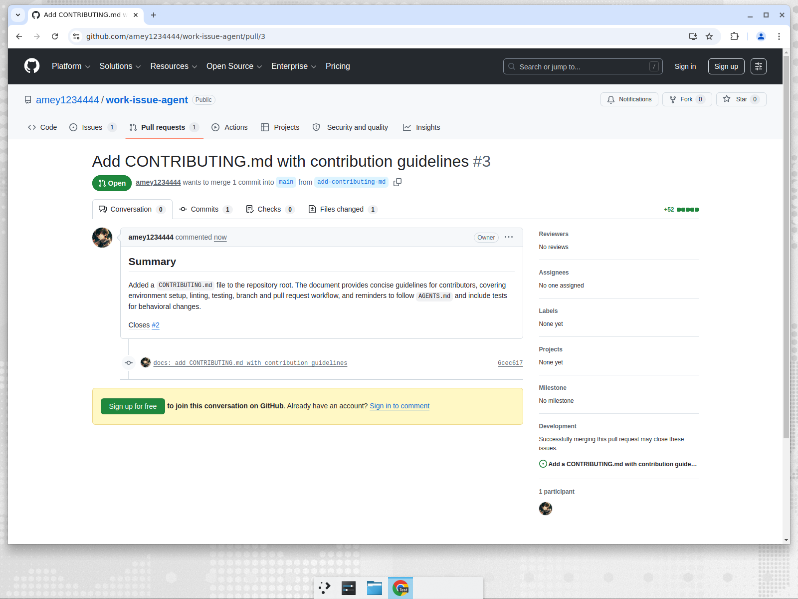
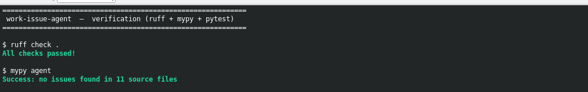

# work-issue-agent

A small, **workflow-driven AI coding agent**. Instead of hardcoding behaviour into
the agent, the agent is driven by:

1. **Slash-style commands** that map to markdown **workflow files** in `.ai/workflows/`.
2. The target repository's own **instruction files** (`AGENTS.md`, `README.md`,
   `CONTRIBUTING.md`, `.github/copilot-instructions.md`, `.ai/rules/*`) — these are
   the source of truth for *how* the agent should behave.

```
ai-agent work-issue https://github.com/org/repo/issues/123
```

does exactly what you sketched out:

```
Read issue
   ↓
Read repo instructions (AGENTS.md, README, CONTRIBUTING, .ai/rules/*)
   ↓
Build a code map (file tree + selected files)
   ↓
Plan (LLM)
   ↓
Implement file edits (LLM)
   ↓
Run tests  ──fail──▶ feed failure back to LLM (up to N times)
   ↓ pass
Commit ▸ Push ▸ Open PR
```

## Why this design

Commands are **data, not code**. Every `.ai/workflows/<name>.md` automatically
becomes a runnable command, so adding `/fix-bug`, `/add-feature`, `/review-pr`,
etc. is just adding a markdown file — no code changes. The repo itself becomes the
behaviour spec, which scales far better than stuffing everything into one prompt.

## Demo (live run)

A real run against this repository, using the OpenRouter provider with the free
`openai/gpt-oss-120b:free` model:

```bash
LLM_PROVIDER=openrouter OPENROUTER_MODEL=openai/gpt-oss-120b:free \
ai-agent work-issue https://github.com/amey1234444/work-issue-agent/issues/2 --path .
```

Output:

```text
Fetched issue #2: Add a CONTRIBUTING.md with contribution guidelines
Loaded 2 instruction file(s), 2 rule(s).

== Planning (openrouter) ==
Understanding:
  The issue requests adding a new CONTRIBUTING.md file at the repository root ...

Plan:
  1. Create a new file CONTRIBUTING.md at the repository root ...
  2. Ensure the markdown follows the style of existing docs and is concise.
  3. Run the test suite (pytest -q) and lint (ruff check .) ...
  4. Provide the test command (pytest -q) for the PR metadata.

== Implementing (attempt 1/3) ==
Changes:
  created CONTRIBUTING.md
Running: ['pytest -q']
Tests passed.

Summary: Added CONTRIBUTING.md with concise contribution guidelines

Opened PR: https://github.com/amey1234444/work-issue-agent/pull/3
```

The agent read [issue #2](https://github.com/amey1234444/work-issue-agent/issues/2),
planned, wrote `CONTRIBUTING.md`, ran the test suite, and opened
[PR #3](https://github.com/amey1234444/work-issue-agent/pull/3) — fully autonomously:



## Verification

Lint, type-check and the test suite all pass:

```text
$ ruff check .
All checks passed!

$ mypy agent
Success: no issues found in 11 source files

$ pytest -q
..............                                                           [100%]
14 passed in 0.05s
```



## Install

```bash
git clone <this-repo>
cd work-issue-agent
python -m venv .venv && source .venv/bin/activate
pip install -e ".[all]"     # or .[anthropic] / .[openai]
```

## Configure

Copy `.env.example` to `.env` and fill in:

```bash
cp .env.example .env
```

| Variable             | Purpose                                                      |
|----------------------|--------------------------------------------------------------|
| `LLM_PROVIDER`       | `anthropic` \| `openai` \| `openrouter` \| `mock`            |
| `ANTHROPIC_API_KEY`  | required when provider is `anthropic`                        |
| `OPENAI_API_KEY`     | required when provider is `openai`                           |
| `OPENROUTER_API_KEY` | required when provider is `openrouter`                       |
| `OPENROUTER_MODEL`   | OpenRouter model slug (default `openai/gpt-oss-120b:free`)   |
| `GITHUB_TOKEN`       | classic PAT with `repo` scope (read issues, open PR)         |
| `AGENT_MAX_ITERATIONS` | self-correction loops on test failure (default 3)          |

`mock` needs no API key and returns a deterministic response — handy for trying
the pipeline end-to-end offline.

**OpenRouter** is an OpenAI-compatible gateway to hundreds of models; a free-tier
key can run `:free` model slugs (e.g. `openai/gpt-oss-120b:free`). Set
`LLM_PROVIDER=openrouter` and `OPENROUTER_API_KEY=...`.

## Usage

List the commands available in a repo (discovered from `.ai/workflows/`):

```bash
ai-agent list --path /path/to/target/repo
```

Resolve an issue and open a PR:

```bash
ai-agent work-issue https://github.com/org/repo/issues/123 --path /path/to/repo
```

Run any workflow with a free-form prompt instead of an issue:

```bash
ai-agent run add-feature --prompt "Add a --json flag to the export command" --path .
```

Useful flags:

- `--dry-run` — plan only, make no edits (great for inspecting what the agent intends).
- `--no-pr` — apply edits and run tests locally, but don't commit/push/open a PR.
- `--provider mock|anthropic|openai` — override the provider for one run.
- `--base <branch>` — base branch for the PR (defaults to the repo's default branch).

## Use as a library

The agent is also importable, so you can drive a run from your own Python code,
a backend service or a notebook — pass the API key and issue URL as arguments
and it does the rest:

```python
from agent import work_issue  # distribution name: work-issue-agent

result = work_issue(
    "https://github.com/org/repo/issues/123",
    provider="openrouter",            # "anthropic" | "openai" | "openrouter" | "mock"
    api_key="sk-or-...",              # optional; falls back to the provider's env var
    model="z-ai/glm-4.5-air:free",    # optional; overrides the default for the provider
    repo_path="/path/to/local/checkout",
    github_token="ghp_...",           # optional; falls back to GITHUB_TOKEN / GITHUB_PAT
    open_pr=True,                     # False = apply + test only, no commit/push/PR
)

print(result.tests_passed)   # bool
print(result.pr_url)         # str | None
print(result.summary)        # the model's summary of what changed
print(result.changed_files)  # list[str]
```

`work_issue(...)` is sugar for `run_workflow("work-issue", issue_url=...)`. Use
`run_workflow(<name>, prompt=...)` to drive any other workflow (e.g. `fix-bug`,
`add-feature`) with a free-form prompt instead of an issue. Pass an `on_event`
callback `(kind, message)` to stream progress, or set `dry_run=True` to get just
the plan. Unrecoverable problems raise `agent.AgentError`; everything
else comes back on the `WorkflowResult`.

## How a run works

1. **Context** (`agent/context.py`) — reads instruction files, `.ai/rules/*`, and a
   `git ls-files` file tree of the target repo.
2. **Plan** (`agent/workflow.py::Agent.plan`) — the LLM returns a JSON plan listing the
   files it needs to read and the steps it will take.
3. **Implement** (`Agent.implement`) — the agent loads the requested files and the LLM
   returns JSON file edits + a test command + PR metadata.
4. **Apply & test** (`agent/editor.py`, `agent/runner.py`) — edits are applied (with a
   guard against escaping the repo root) and the test command runs. On failure the
   output is fed back to the LLM, up to `AGENT_MAX_ITERATIONS`.
5. **PR** (`agent/git_ops.py`, `agent/github_client.py`) — branch, commit, push and open
   a pull request via the GitHub REST API.

## Project layout

```
agent/
  cli.py            # argparse entrypoint; turns .ai/workflows/*.md into commands
  config.py         # .env + env + .ai/config.yaml loading
  context.py        # gather instruction files + file tree + selected files
  github_client.py  # fetch issues, create repos/PRs (GitHub REST)
  llm.py            # provider abstraction: anthropic | openai | mock
  workflow.py       # planning/coding loop + robust JSON extraction
  editor.py         # apply file edits safely
  runner.py         # run tests/lint and capture output
  git_ops.py        # branch / commit / push helpers
  models.py         # typed dataclasses (Issue, Plan, FileEdit, Implementation)
.ai/
  config.yaml       # which instruction files/rules/test command to use
  workflows/*.md    # the commands (work-issue, fix-bug, add-feature, ...)
  prompts/*.md      # optional overrides for planner/coder system prompts
  rules/*.md        # extra rules injected into context
tests/              # pytest suite
```

## Extending

- **New command**: drop a markdown file in `.ai/workflows/`. It is instantly available
  via `ai-agent run <name>`.
- **Different behaviour per repo**: edit that repo's `AGENTS.md` / `.ai/rules/*`.
- **Custom prompts**: add `.ai/prompts/planner.md` or `.ai/prompts/coder.md`.

This is the Option 1 (local CLI MVP) from the design discussion. The clean module
boundaries make it straightforward to later wrap in a backend service, a queue and
multiple specialised agents (planner/coder/tester/reviewer) once the MVP reliably
solves issues.

## License

MIT
